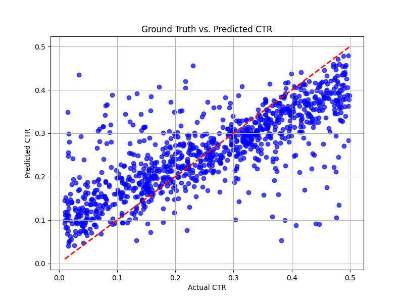

# 🎯 Multi-Agent CTR Prediction Pipeline using LangGraph

## 📖 Overview

Online advertising platforms process millions of ad impressions daily. A critical business challenge is predicting whether a user will click on an advertisement before investing advertising spend.

Click-Through Rate (CTR) prediction plays a vital role in:

* Improving ad targeting
* Increasing customer engagement
* Optimizing marketing budgets
* Maximizing advertising revenue

Traditional machine learning workflows require multiple manual steps including data preprocessing, feature engineering, model training, evaluation, and visualization. Managing these steps individually can be time-consuming and difficult to scale.

This project introduces a **Multi-Agent Machine Learning Pipeline** built with **LangGraph**, where specialized agents collaborate to automate the complete CTR prediction workflow.

---

## 🚨 Problem Statement

Digital advertising companies need accurate CTR predictions to make informed bidding and targeting decisions.

However, raw advertising datasets often contain:

* Categorical features that cannot be directly processed by machine learning models
* Numerical features with varying scales
* Multiple disconnected processing stages
* Limited workflow transparency and traceability

These challenges make building reliable prediction pipelines difficult.

---

## 💡 Solution

To address these challenges, this project implements a **Multi-Agent System** where each agent specializes in a specific stage of the machine learning lifecycle.

The workflow automatically:

✅ Encodes categorical features

✅ Standardizes numerical features

✅ Trains a CTR prediction model

✅ Generates CTR predictions

✅ Evaluates model performance

✅ Visualizes prediction results

The agents communicate through a shared LangGraph state, creating a modular and scalable architecture.

---

## 🤖 Multi-Agent Architecture

### 🔍 EDA Agent

Responsible for:

* Label Encoding categorical variables
* Standardizing numerical features
* Preparing data for model training

### 📈 Statistics Agent

Responsible for:

* Training a Random Forest Regressor
* Generating CTR predictions
* Calculating Mean Squared Error (MSE)

### 📊 Visualization Agent

Responsible for:

* Comparing actual and predicted CTR values
* Creating scatter plots for performance analysis

---

## 🏗️ Workflow Architecture

```text
Input Dataset
      │
      ▼
┌─────────────────┐
│   EDA Agent     │
│ Feature Encoding│
│ Data Scaling    │
└────────┬────────┘
         │
         ▼
┌─────────────────┐
│ Statistics Agent│
│ Model Training  │
│ CTR Prediction  │
└────────┬────────┘
         │
         ▼
┌─────────────────┐
│ Visualization   │
│     Agent       │
│ Performance Plot│
└────────┬────────┘
         │
         ▼
       Output
```

---

## 📊 Dataset

The dataset contains advertisement impression information:

| Feature    | Description                          |
| ---------- | ------------------------------------ |
| ad_type    | Type of advertisement                |
| time_spent | User engagement duration             |
| ctr        | Click Through Rate (Target Variable) |

---

## ⚙️ Machine Learning Pipeline

### Step 1: Data Preprocessing

* Label Encoding using `LabelEncoder`
* Feature Scaling using `StandardScaler`

### Step 2: Model Training

* Train-Test Split (80:20)
* Random Forest Regressor Training

### Step 3: Prediction

* CTR prediction generation
* Prediction storage in dataset

### Step 4: Visualization

* Scatter plot of Actual CTR vs Predicted CTR
* Performance analysis

---

## 🛠️ Tech Stack

* Python
* LangGraph
* LangChain
* Scikit-Learn
* Pandas
* Matplotlib
* Random Forest Regressor
* Machine Learning
* Multi-Agent Systems

---

## 📂 Project Structure

```text
project/
│
├── main.py
├── ctr-prediction-dataset.csv
├── ctr_scatter_plot.png
├── requirements.txt
└── README.md
```

---

## 🚀 Installation

### Clone Repository

```bash
git clone https://github.com/your-username/multi-agent-ctr-prediction-pipeline.git
cd multi-agent-ctr-prediction-pipeline
```

### Install Dependencies

```bash
pip install -r requirements.txt
```

### Run Application

```bash
python main.py
```

---

## 📈 Results

Pipeline Execution Log:

```text
Starting Multi-Agent System...

--- EDA AGENT WORKING ---
--- STATISTICIAN AGENT WORKING ---
--- VISUALIZATION AGENT WORKING ---

Start the process.

EDA done: Successfully encoded 'ad_type' to 'ad_type_encoded'.
Successfully standardized 'time_spent' to 'time_spent_scaled'.

Stats done: Model trained successfully.
Mean Squared Error: 0.0081.

Viz done: Scatter plot generated and saved as 'ctr_scatter_plot.png'.
```

### Model Performance

📌 Mean Squared Error (MSE): **0.0081**

A lower MSE indicates that predicted CTR values are closely aligned with actual CTR values.

---

## 📷 Visualization

Place the generated image in the repository root folder and GitHub will automatically display it:

```markdown

```


---

## 🔮 Future Enhancements

* Add Model Comparison Agent
* Hyperparameter Optimization
* Conditional Agent Routing
* Automated Model Selection
* LLM-driven Dynamic Tool Selection

---

## 🏆 Conclusion

This project demonstrates how Agentic AI and LangGraph can be leveraged to orchestrate an end-to-end machine learning workflow.

By decomposing the CTR prediction pipeline into specialized agents, the system achieves improved modularity, transparency, scalability, and maintainability while automating the complete prediction lifecycle.
